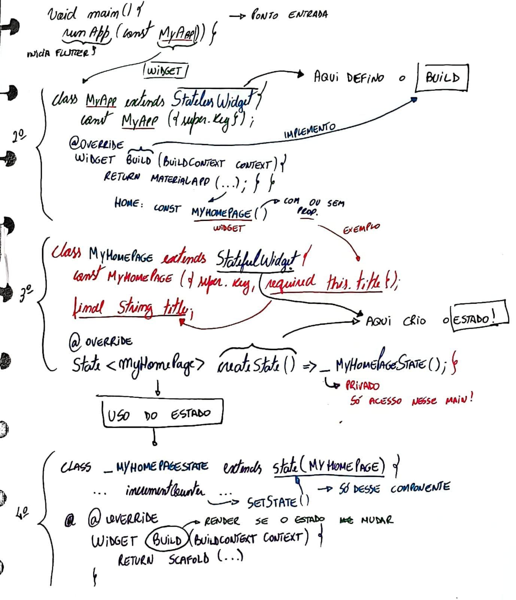

# 🔥 APP

### Introdução

Neste segmento do projeto EstimulaAI, vou enfretar um grande desafio: desenvolver um aplicativo usando [Flutter](https://flutter.dev/).&#x20;

A decisão de utilizar Flutter foi estratégica, visando democratizar o acesso ao EstimulaAI ao permitir a exportação do código para todas as principais plataformas - iOS, Android e web.

Com isso, ganto que famílias de diferentes contextos tecnológicos possam beneficiar-se do app, independentemente do dispositivo que possuem.

### Por que Flutter?

Flutter é um framework desenvolvido pelo Google que permite a construção de aplicativos nativos compilados para múltiplas plataformas a partir de uma única base de código.&#x20;

### Estrutura Simplificada

O aplicativo EstimulaAI é projetado para ser intuitivo e fácil de usar, consistindo de uma única tela que inclui:

1. **Campos de Entrada**:
   * **Idade da Criança**: Onde os usuários inserem a idade do infante.
   * **Objetos Disponíveis**: Campo para listar os objetos que estão à mão.
   * **Foco de Desenvolvimento**: Opções para selecionar o aspecto do desenvolvimento que deseja estimular, como fala, coordenação motora, entre outros.
2. **Botão Gerar**: Após preencher os campos, o usuário pressiona este botão para gerar uma atividade baseada nas informações fornecidas.
3. **Resultado**: A atividade sugerida é exibida abaixo dos campos de entrada, oferecendo aos usuários uma descrição clara e concisa da brincadeira, juntamente com instruções sobre como proceder.

### Começando...

Bem, como não tenho conhecimento com Flutter, encontrei um [vídeo ](https://www.youtube.com/watch?v=J4BVaXkwmM8)do Felipe Deschamps junto com o Guilherme Silveira ensinando a usar o Flutter.&#x20;

Essas foram minhas anotações para tentar entender e seguir:

Meus Rabiscos 📝

Criada o Hello World em Flutter, vamos ao desenvolvimento do projeto e conexão da API.
