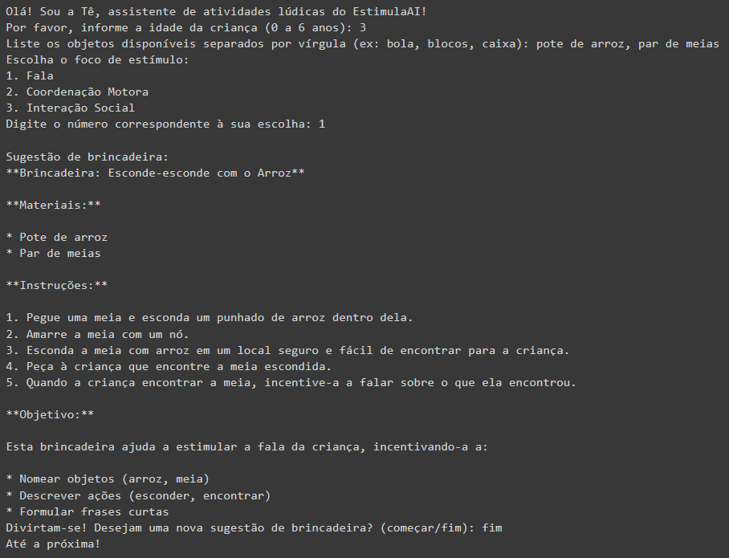

# Protótipo

Com a jornada de usuário definida, começo a construir o fluxo do nosso protótipo.

<figure><figcaption><p>Fluxo MVP do EstimulaAI</p></figcaption></figure>

O link para o notebook dessa construção está disponível em: [https://colab.research.google.com/drive/1ijGf9Sge0jfzakvZRyJOjTGPfivswfT8?usp=sharing](https://colab.research.google.com/drive/1ijGf9Sge0jfzakvZRyJOjTGPfivswfT8?usp=sharing)

Em resumo, utilizei o [padrão fornecido pela Alura](https://colab.research.google.com/drive/1wFIctGOaYwlgXD8xsyBiSi5LmTHrObai?usp=sharing#scrollTo=dAcbPBocgzeX) para construir rapidamente o protótipo, com algumas modificações no código.&#x20;

### **Desenvolvimento do Protótipo**

O protótipo do EstimulaAI foi desenvolvido no Google Colab utilizando o SDK do Google GenerativeAI. Após a instalação e configuração inicial, selecionei o modelo Gemini-1.0-pro <mark style="background-color:blue;">**devido à sua capacidade de ajustar configurações de segurança, essencial para garantir que as brincadeiras sugeridas sejam seguras e apropriadas para crianças**</mark>.

A interface simples do usuário solicita apenas a idade da criança, os objetos disponíveis e o foco desejado para estimulação, como fala ou coordenação motora.

### Testes

Durante os testes, o modelo foi capaz de gerar várias brincadeiras criativas e seguras.&#x20;

Por exemplo, a "Brincadeira Esconde-esconde com o Arroz" foi especialmente desenvolvida para uma criança de 3 anos, utilizando apenas um par de meias e um pote de arroz para estimular a fala.&#x20;

As instruções detalhadas e objetivas ajudam os pais a facilitar a brincadeira, promovendo o desenvolvimento da criança de forma divertida e interativa.

Além disso, o objetivo para que a pessoa que esteja brincando com a criança tenha mais motivação 🥰

<figure><figcaption><p>Resultado do Protótipo</p></figcaption></figure>

### Código e Prompt

O código abaixo foi desenvolvido com o conhecimento que tenho em Python (com ajuda da live da imersão) e também ajuda do Google Gemini.&#x20;

```python
def gerar_brincadeira(idade, objetos, foco):
  """Gera uma sugestão de brincadeira com base nos inputs."""
  prompt = f"""Crie uma brincadeira lúdica,
               para uma criança de {idade} anos de idade,
               que tenha os itens ({objetos}),
               e que ajude a estimular a {foco}.
               A brincadeira deve ser segura e apropriada para a idade.
               Ao final diga de forma concisa o único objetivo onde a 
               brincadeira irá auxiliar no desenvolvimento
               """
  response = model.generate_content(prompt)
  return response.text
  
def coletar_inputs():
  """Coleta inputs do usuário sobre idade, objetos e foco."""
  idade = int(input("Por favor, informe a idade da criança (0 a 6 anos): "))
  objetos = input("Liste os objetos disponíveis separados por vírgula (ex: bola, blocos, caixa): ")
  
  # Opções para o foco de estímulo
  focos = ["Fala", "Coordenação Motora", "Interação Social"]
  print("Escolha o foco de estímulo:")
  for i, foco in enumerate(focos):
    print(f"{i+1}. {foco}")
  escolha = int(input("Digite o número correspondente à sua escolha: "))
  foco = focos[escolha-1]
  
  return idade, objetos, foco

# Início da interação
print("Olá! Sou a Tê, assistente de atividades lúdicas do EstimulaAI!")

# Coletar inputs iniciais
idade, objetos, foco = coletar_inputs()

# Gerar e apresentar a sugestão de brincadeira
brincadeira = gerar_brincadeira(idade, objetos, foco)
print("\nSugestão de brincadeira:")
print(brincadeira)

# Opção para nova brincadeira
while True:
  resposta = input("Divirtam-se! Desejam uma nova sugestão de brincadeira? (começar/fim): ")
  if resposta.lower() == "fim":
    print("Até a próxima!")
    break
  elif resposta.lower() == "começar":
    # Coletar novos inputs usando a função
    idade, objetos, foco = coletar_inputs()

    # Gerar e apresentar a nova sugestão
    nova_brincadeira = gerar_brincadeira(idade, objetos, foco)
    print("\nNova sugestão de brincadeira:")
    print(nova_brincadeira)
  else:
    print("Desculpe, não entendi. Por favor, digite 'começar' ou 'fim'.")
```

### Próximo Passo

Se seu não conseguir, essa vai ser a entrega, mas o objetivo é a construção de um APP para democratizar o acesso à população. Na próxima página o resultado.
